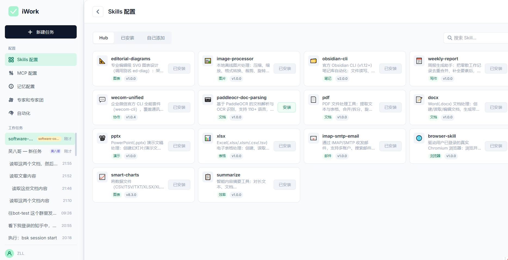
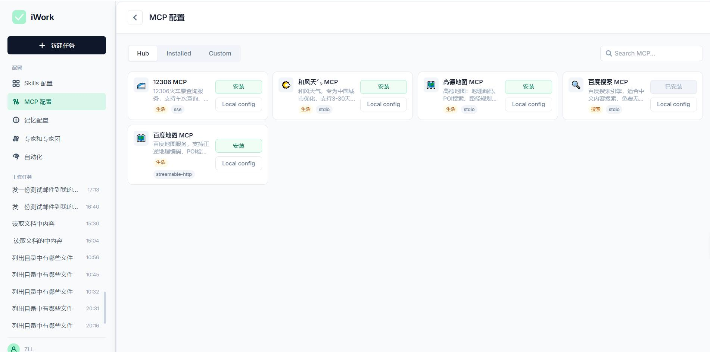
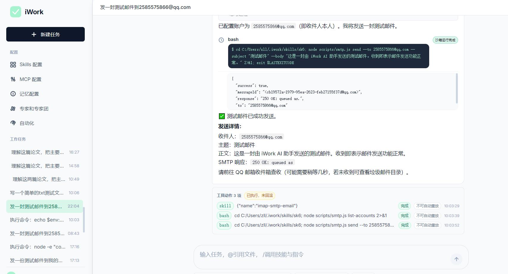
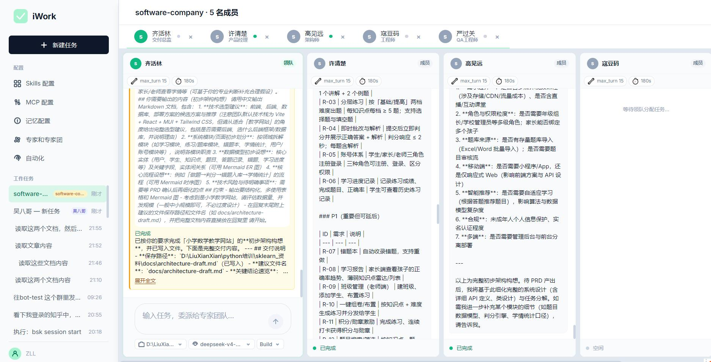
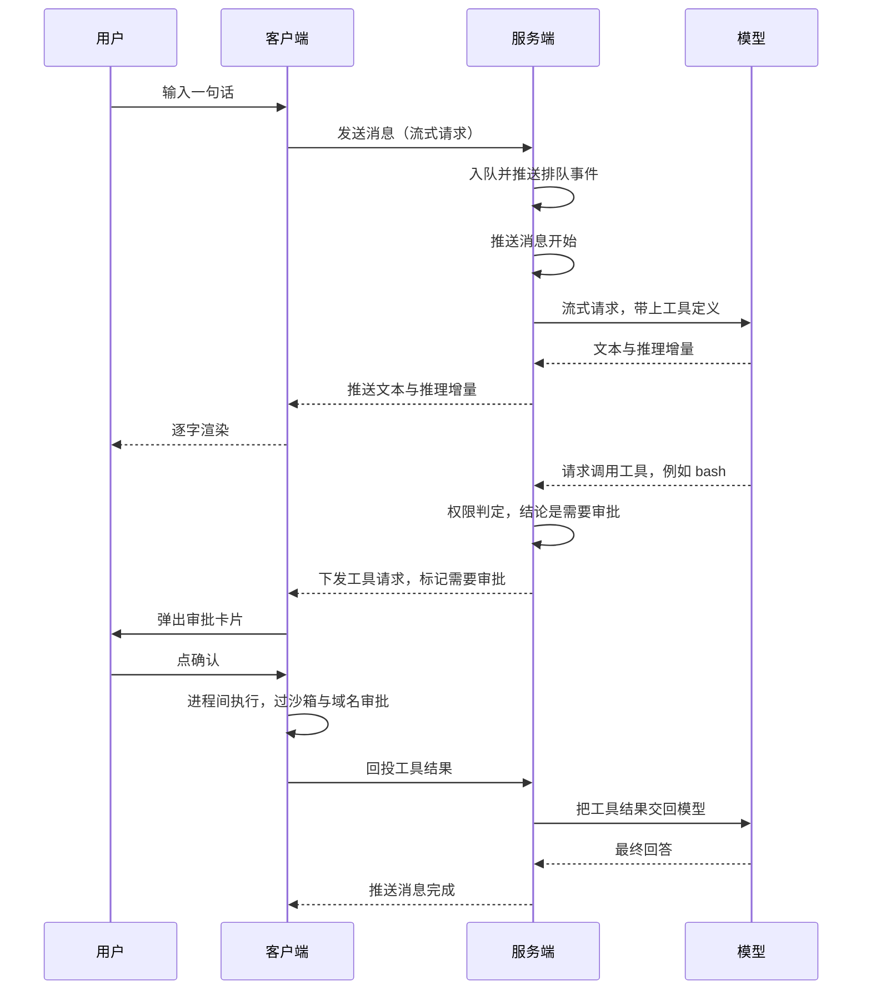

<h1 align="center">
  
  &nbsp;iWork
</h1>

<p align="center">
  
  
  
  
  
  
  
  
  
  
</p>

本工程采取C/S 模式开发，一句话概况「治理集中，执行本地」。需要统一管控的事情留在服务端，需要碰真实资源的事情放到用户机器上。判断标准是资源在哪儿 —— 你的代码、密钥、内网服务都在本地，让一个远端进程去直接读写它们既不安全也没必要；反过来，上下文、token 消耗、模型调用、审计这些需要集中治理的部分，一旦放到各人本地，就等于每个终端一套政策，管不住。

| | 服务端 | 客户端 |
|---|---|---|
| **角色** | 大脑 + 政策制定者 | 手 + 执行现场 |
| **负责** | Query Loop 编排、模型调用、上下文压缩、权限判定、会话持久化、审计与指标 | 对话界面、文件读写、shell 执行、MCP 子进程、沙箱、域名审批 |
| **不负责** | 不亲自执行文件与命令类工具，只判断该不该执行、要不要审批、要不要进沙箱，然后把决策下发 | 不调用模型、不管上下文与 token |


| Skill 中心 · Hub | MCP 中心 · Hub |
|---|---|
|  |  |

| 问答执行 | 专家团并行协作 |
|---|---|
|  |  |


## 一次完整交互



这条链路把 C/S 的分工讲全了：中间那次工具调用没有跨过进程边界，服务端只负责判断"这一步需要审批"，真正的执行与拦截都发生在客户端。

## 功能清单

| 模块 | 能做什么 |
|---|---|
| 会话与消息 | 1. 多会话隔离，每个会话有独立引擎与消息队列<br>2. 队列满（默认 10）直接拒绝入队，不静默堆积<br>3. 取消、重新生成、续写、事件回放各有独立入口<br>4. 单条消息有等待 → 处理中 → 完成 / 出错 / 已取消的状态流转，会话本身只有活跃与归档 |
| Query Loop 引擎 | 1. 单条消息最多 25 轮工具调用，总超时 1800 秒<br>2. 输出被长度上限截断时自动追加"继续"重试，最多 3 次，超过才判定为错误<br>3. 单轮读操作并发闸门默认 8 个，避免一轮里几十个读操作同时打库<br>4. Plan 模式下先产出计划，交用户确认、编辑或回答提问后才动手 |
| 上下文管理 | 1. 估算 token 超过模型窗口比例才触发压缩：构建模式八成、问答模式五成半<br>2. 两级压缩：先压单个块，再让模型合并更早的层<br>3. 模型窗口上限可配，默认 65536<br>4. 超长内容卸载到单独存储，不再占用模型窗口<br>5. 累计 token 用量随事件推给客户端 |
| 记忆管理 | 1. 后台按时机从对话里自动抽取结构化原子记忆（画像 / 事件 / 规则），无需模型自觉写<br>2. 每条新用户消息先做一次相关记忆召回，命中则拼进用户消息前缀，不污染 system 提示词缓存<br>3. 新记忆与已有记忆去重合并，被取代的旧版本软删但保留血缘<br>4. 模型可主动调检索工具兜底，每轮限次<br>5. 检索用字符 n-gram TF-IDF 加余弦相似度，不依赖向量库<br>6. 原子记忆再整合成跨会话的场景叙事（存库，正文为 markdown），默认更新既有场景，合并时须列出被并场景<br>7. 场景导航（名字 / 热度 / 摘要）追加在 system 提示词最末，超预算按热度丢尾<br>8. 场景热度按被整合次数累加，分单火至五火五档；模型要看全文时按名字读取，未命中回可用名单，每轮限次 |
| 内置工具 | 1. 客户端内置工具：bash、文件读写与编辑、文件查找与内容搜索<br>2. 服务端内置工具：记忆检索、场景按名读取、卸载块召回、派生子 agent<br>3. 读写分类由读工具白名单决定，没列进去的一律按写工具处理<br>4. 客户端内置工具全部经过审批与沙箱 |
| MCP 工具 | 1. 支持标准输入输出、SSE、可流式 HTTP 三种连接方式<br>2. 清单只做登记，进程由客户端拉起，服务端不派生任何 MCP 进程<br>3. 工具对外命名带上来源标识，避免重名<br>4. 密钥可用占位符从客户端进程环境读取，不必写进配置文件 |
| Skill | 1. 从预置清单安装与卸载<br>2. 支持自定义 skill 的增删改<br>3. 内置 skill 覆盖文档处理、OCR、邮件、企业微信等场景 |
| 权限管理 | 1. 三态判定：放行、需要审批、禁止<br>2. 全局开关可选按需询问 / 从不询问 / 细粒度<br>3. 内置只读、工作区、完全放行三档画像，外加危险命令启发式与规则表<br>4. 命令类、规则类、网络类审批可分别开关<br>5. 客户端再兜一层：Windows 写权限沙箱与域名审批弹窗 |
| Hooks 设计 | 1. 六个挂载点覆盖消息前后、模型调用前后、工具执行前后<br>2. 子进程从标准输入收 JSON、往标准输出回一个动作（放行 / 改写输入 / 叫停）<br>3. 异常与超时一律放行<br>4. 跑脚本前会从环境变量里滤掉看起来像密钥的项 |
| 多 Agent | 1. 由任务工具派生子 agent，父子之间通过会话邮箱通信<br>2. 父任务可以挂起等子任务，也能收到子 agent 的状态流转<br>3. 子 agent 默认继承父上下文最近三轮对话，也可选择不继承或全部继承<br>4. 同时并发上限 4 个，超限直接失败而不是排队<br>5. 每个会话只有一个引擎协程在跑，空闲引擎按最久未用优先逐出 |
| 可观测性 | 1. 可选的链路追踪、Prometheus 指标、审计日志查询<br>2. 内部事件总线只挂两个订阅者（推客户端、落审计库），避免旁路逻辑越长越多 |
| 幂等性设计 | 1. 每次工具调用都记账并带幂等键，重复请求可以拿出来对账<br>2. 客户端有一条本地 outbox，回投失败时幂等重投，避免工具被重复执行<br>3. 回投超时后服务端推对账请求，判断到底执行了没有<br>4. 写类操作结果不明时标记为待确认，请用户判断是否已执行<br>5. 会话的副作用账本可以查询 |
| 专家与专家团 | 1. 一个专家就是一个带清单文件的目录，可含专属 skill、头像与 agent 定义<br>2. 专家团支持多列并行会话 |
| 客户端界面 | 1. 逐字打字机渲染，文本 / 推理 / 工具卡分段展示<br>2. 单条消息可以重跑<br>3. 计划编辑侧栏、工具审批卡、网络域名审批弹窗<br>4. 配置中心管 MCP、Skills、记忆与规则、专家与专家团<br>5. 本地工作区选择、任务列表、按任务分桶的排队状态 |


## 待办

目标：达到可发布状态。🔴 为发布阻塞项。

### 🔴 阻塞

- **账号与登录** — `users` 表无 `email` / `password_hash` / `role`；`server/api/deps.py` 的 `get_default_user_id` 被 24 处路由以 `Depends(...)` 引用，全部返回同一个种子用户。规格见 `docs/requirements.md` §2.8。
- **多用户隔离未生效** — Skills / MCP / 记忆 / 任务都有 `user_id` 列，但永远填同一个值，§2.8.3 的隔离表落不了地。
- **打包后客户端连不上后端** — 服务端地址只由 Vite dev proxy 提供，production build 不含它；`apiBaseUrl` 默认空串且无 UI 可改。
- **从未打过安装包** — `agent-client/out/` 有、`dist/` 无，只跑过 `dev` / `build`。上一条 bug 因此从未暴露。
- **Hub 管理端缺失** — 数据源是 `server/skill-hub.json` 等 JSON 文件，改目录 = 手改 + 重启；experts / teams 无 mutation 端点。
- **管理端点无鉴权** — `/admin/audit`、`/skills/hub` 与 `/mcp/hub` 的增删改全部开放。
- **MCP 越权** — `server/api/mcp_routes.py:182` 的工具上报端点从请求体读 `user_id`（同文件其余端点都走 `Depends`），可往他人命名空间写。
- **权限引擎放行外挂工具** — `server/tools/permission.py` 的 `_evaluate_other` 对 MCP / skill / 自定义工具一律放行，绕过审批。
- **无部署产物与 CI** — 无 Dockerfile / compose、无 `.github/`、无 `pyproject.toml`。

### 非阻塞

- **审计表无限增长** — `audit_retention_days` 已声明未消费。
- **审计 action 不可枚举** — `server/observability/audit.py` 用 `f"tool.{tool_name}"` 动态拼，统计无法分组。
- **服务端统计无展示面** — 审计只有裸 API；客户端「我的用量」只有类型声明无渲染。
- **无端到端测试** — 52 个测试文件全是 in-process，无一启动 HTTP。
- **记忆模块（L1 + L2）未提交** — `server/memory/`（含 `l2/`）、迁移 015/016/017、11 个测试文件均 untracked。

### v1 不做

OAuth、邮件找回密码（需补管理员重置，否则用户锁死无路可走）、真·审核流（用 draft → publish 两步替代）、按内容类型分域管理、配额计费、跨 agent 写锁。


## 快速开始

### 1. 服务端

```bash
cd i-work

# 需要 Python 3.12：https://www.python.org/downloads/ （Windows 装完勾选 Add to PATH）
pip install -r requirements.txt

cp .env.example .env                                   # 至少填 IWORK_DATABASE_URL 与模型 Key

cd server && alembic upgrade head && cd ..             # 建表

python -m uvicorn server.main:app --host 127.0.0.1 --port 8000
```

需要一个可连的 PostgreSQL。首次启动会自动灌种子数据（默认用户、skill 与 MCP 清单、专家与专家团），表非空就跳过，可以重复启动。起来之后访问 /health 应返回 `{"status":"ok"}`，访问 /metrics 是 Prometheus 指标。

### 2. 客户端

```bash
cd agent-client

# 需要 Node.js 20.0.0+：https://nodejs.org/ （npm 随 Node 一起装）
npm install
cp .env.example .env        # 要用和风天气 MCP 时填 VITE_HEFENG_API_KEY

npm run dev
```

### 3. Skill 前置条件（按需）

Skill 的脚本在**客户端本地**执行，所以下面这些软件与凭证都装在你自己这台机器上，不在服务端。只有下表列出的 Skill 需要准备，`weekly-report` 与 `editorial-diagrams` 装上即可用。

| 技能 | 客户端要准备什么 | 一次配置 | 自检 |
|---|---|---|---|
| paddleocr-doc-parsing | 不用装软件，要一个 PaddleOCR 账号 | 设为系统环境变量：`PADDLEOCR_API_URL`、`PADDLEOCR_ACCESS_TOKEN`（在 paddleocr.com 注册后领取，每日有免费额度） | 没配时报错 `PADDLEOCR_API_URL and PADDLEOCR_ACCESS_TOKEN must be set` |
| wecom-unified | Node.js，且 `wecom-cli` ≥ 1.1.0 | `npm install -g @wecom/cli`，再 `wecom-cli auth` 走一次授权 | `wecom-cli auth show --status` 输出 `authorized` |
| obsidian-cli | Obsidian 1.12+，且**必须正在运行** | Settings > General 打开 Enable CLI；`obsidian` 需在 PATH 里（Linux 可能要包一层 wrapper 绕开 Electron 的参数注入） | `obsidian --help` |
| browser-skill | `bsk` CLI 加配套浏览器扩展，另需一个已登录的 Chromium | 按 bsk 官方说明装 CLI 与扩展 | `bsk doctor` |
| imap-smtp-email | Node.js + npm | 在 Skill 目录跑 `bash setup.sh`：装 npm 依赖，并把账号写进 `~/.config/mail-skills/.env`。Gmail 要用应用专用密码，网易系要用授权码而非登录密码 | `node scripts/imap.js check` |
| smart-charts | Python 3.11+ | `pip install -r requirements.txt`（pandas、numpy、openpyxl、xlrd） | `python scripts/cli.py --doctor` |
| image-processor | Python3 + Pillow（或 ffmpeg、ImageMagick 任一） | `pip install pillow` | `python3 scripts/process-image.py 图片.png --compress 80` |
| summarize | Python3 + `requests`、`beautifulsoup4`（只有网页摘要用到） | `pip install requests beautifulsoup4` | `python summarize.py "一段测试文本"` |
| docx / pptx / xlsx / pdf | 命令行工具 pandoc、LibreOffice、Poppler（`pdftoppm`）；Node 全局包；Python 包 | `npm i -g docx pptxgenjs`；`pip install pypdf pdfplumber reportlab pillow "markitdown[pptx]"`；扫描件 OCR 另需 `pip install pytesseract pdf2image` | pandoc 抽一次文本，或 soffice 转一次 PDF |

三点注意：

- 办公四件套的 LibreOffice 不是锦上添花：xlsx 公式重算、docx/pptx 转 PDF 都靠它。只做纯文本抽取可以先不装。
- 上表的配置与自检命令都在 Skill 目录里跑。Skill 装上后解压到 `~/.iwork/skills/<skill_name>/`，先 `cd` 进去再执行。
- 环境变量走**系统环境**（Windows 用 `setx`，macOS/Linux 写进 shell profile），不要写进 `agent-client/.env` —— 那份 `.env` 是构建期注入渲染进程的 `VITE_` 变量，Skill 脚本读的是子进程环境变量，读不到。Windows 上 `setx` 完不用重启客户端，客户端每次执行命令会重读注册表。


