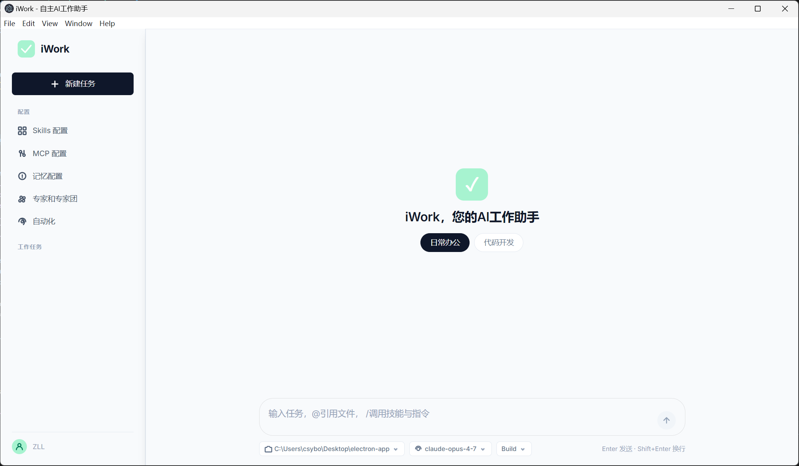
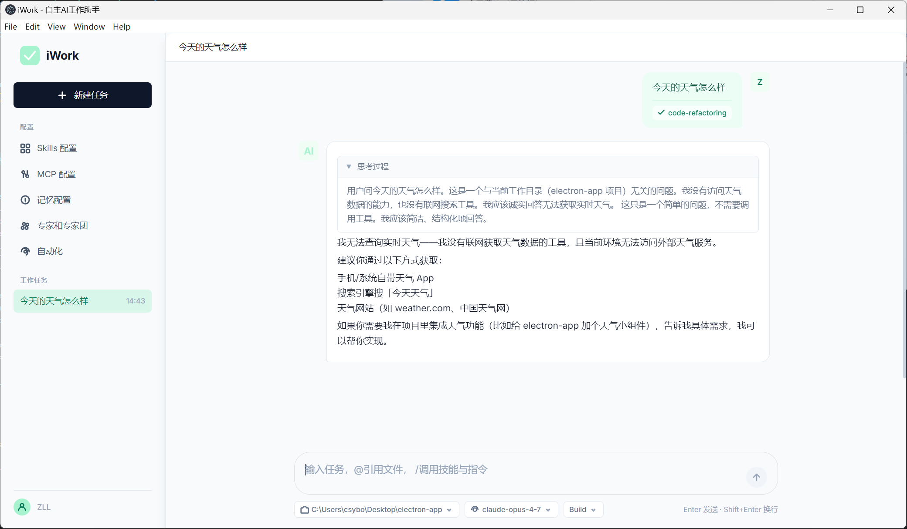
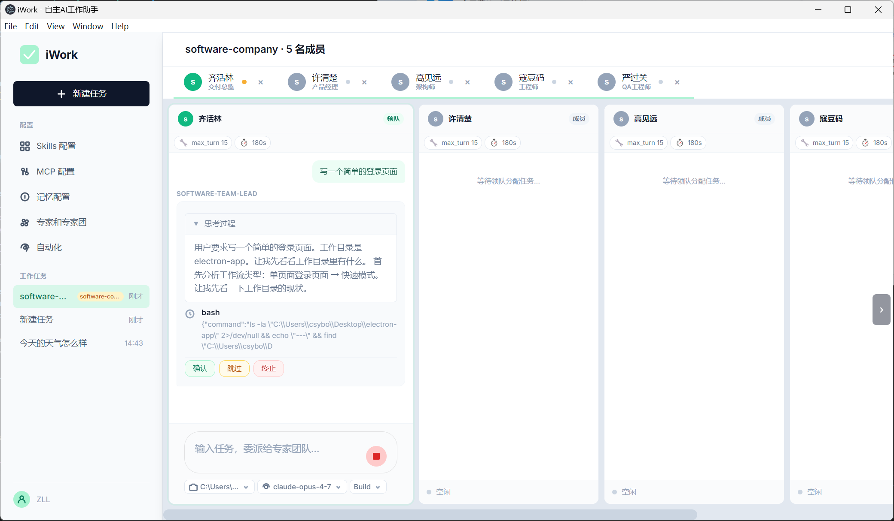
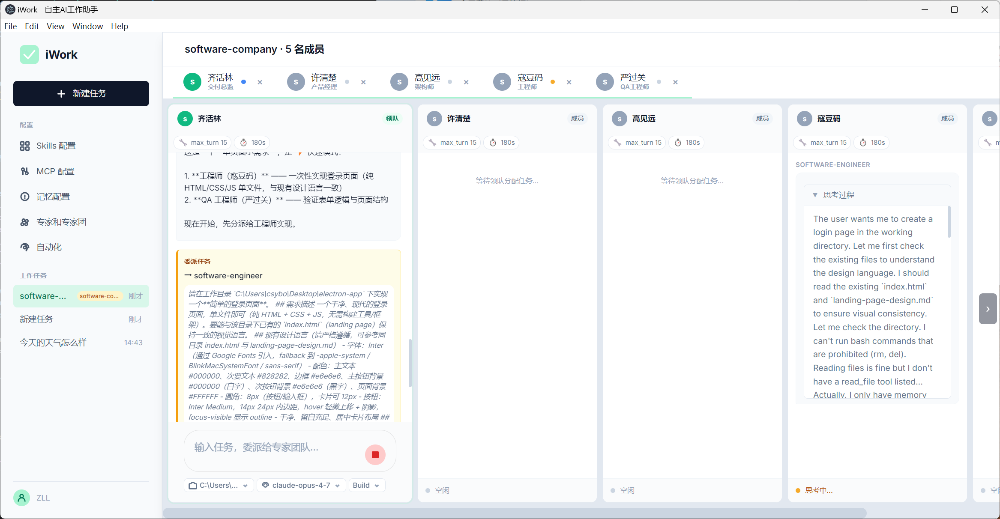
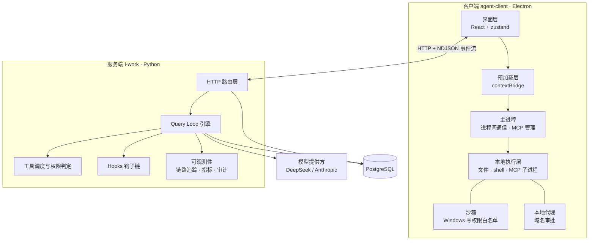
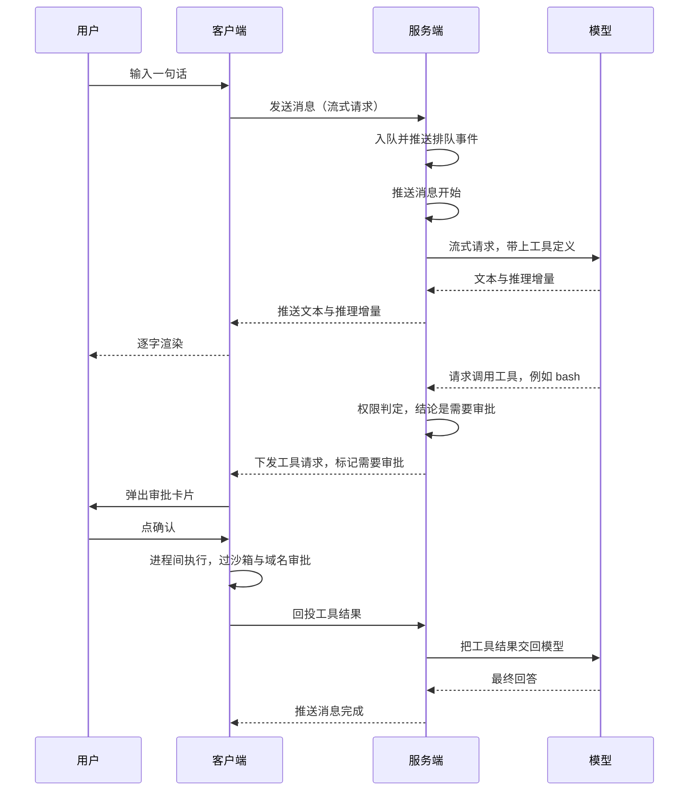

<p align="center">
  
</p>

<h1 align="center">iWork</h1>

<p align="center"><strong>本地优先的 C/S 架构 AI Agent 工作台</strong> —— 推理与编排跑在服务端，文件读写、命令执行、MCP 进程这些真正"动手"的部分留在你自己的机器上，并且套着沙箱与审批。</p>

服务端（i-work/ 目录，Python + FastAPI）负责 Query Loop 引擎、上下文压缩、权限判定、持久化与审计；客户端（agent-client/ 目录，Electron + React）负责对话界面、本地执行、沙箱和审批弹窗。两者之间只有一条契约：HTTP 请求，加一条 NDJSON 事件流。

| 问答 | 工具审批 |
|---|---|
|  |  |

| 专家团 | 专家团协作 |
|---|---|
|  |  |

## 目录

- [核心亮点：C/S 模式](#核心亮点cs-模式)
- [系统架构](#系统架构)
- [一次带审批的完整交互](#一次带审批的完整交互)
- [功能清单](#功能清单)
- [项目是怎么组织的](#项目是怎么组织的)
- [快速开始](#快速开始)
- [配置](#配置)
- [REST API 概览](#rest-api-概览)
- [NDJSON 事件流](#ndjson-事件流)
- [实现状态与已知限制](#实现状态与已知限制)
- [文档索引](#文档索引)
- [开发](#开发)

## 核心亮点：C/S 模式

一句话概括是「治理集中，执行本地」：需要统一管控的事情留在服务端，需要碰真实资源的事情放到用户机器上。判断标准是资源在哪儿 —— 你的代码、密钥、内网服务都在本地，让一个远端进程去直接读写它们既不安全也没必要；反过来，上下文、token 消耗、模型调用、审计这些需要集中治理的部分，一旦放到各人本地，就等于每个终端一套政策，管不住。

| | 服务端 | 客户端 |
|---|---|---|
| **角色** | 大脑 + 政策制定者 | 手 + 执行现场 |
| **负责** | Query Loop 编排、模型调用、上下文压缩、权限判定、会话持久化、审计与指标 | 对话界面、文件读写、shell 执行、MCP 子进程、沙箱、域名审批 |
| **不负责** | 不亲自执行文件与命令类工具，只判断该不该执行、要不要审批、要不要进沙箱，然后把决策下发 | 不调用模型、不管上下文与 token |

这样切最大的好处是**凭据与文件不出本机**，服务端退回成一个"只负责想"的推理节点。另一个好处是拦截拦得住：Windows 的写权限墙和网络代理只有执行现场才有意义，服务端"说一句不许写"是拦不住任何东西的。

工具因此分成两类，由谁执行看工具性质。服务端工具负责记忆的读写检索，以及派生一个子 agent 去干活；客户端工具要碰你的机器，包括 bash、文件读写与编辑、文件查找与内容搜索，以及全部 MCP 工具（对外命名为「来源标识_工具名」，避免不同 MCP 之间重名）。

### 支撑这套模式的五个机制

**一、流式协议选了 NDJSON。** 发消息这个接口直接返回一行为一个 JSON 事件的流，每个事件自带自增序号，客户端逐行解析后按类型分发。没有用 SSE 也没有用 WebSocket，是因为 NDJSON 同时满足两点：既能流式推进，又天然可以逐行重放，断线恢复不必再设计一套协议。

**二、断线续传。** 服务端为每个会话维护一个默认容量 500 的环形缓冲，重连时客户端报上自己最后收到的序号，把中间丢掉的增量补齐。工具结果另有一条本地 outbox 做幂等重投，避免"工具已经执行了、结果却没投递成功"导致的重复执行。

**三、人在环中的三道闸。** 第一道是计划确认：Agent 动手前先把计划交给你确认、编辑，或者回答它的提问。第二道是工具审批：需要审批的工具弹卡片，拒绝就跳过，并且把跳过原因回灌给模型，让它知道这条路走不通，而不是反复重试。第三道是外部 hook 脚本，静态策略之外的最后一道防线，脚本可以放行、改写输入或直接叫停，默认启用的一条会拦下删根目录这类命令。客户端还会再兜一层：沙箱用 Windows 受限令牌加按工作区派生的写白名单，只限写不限读，沙箱初始化失败就拒绝执行而不是降级放行；域名审批走一个本地零依赖的 HTTP 代理，只按主机名判定、不做中间人解密，不在白名单里的域名弹窗等你确认。

**四、客户端工具怎么执行、怎么回投。** 服务端先推一个工具请求事件，带上请求标识、工具名、入参、是否需要审批、命中的策略和幂等键；客户端必要时先弹审批，再经进程间通道执行，然后把结果投回服务端。如果等待结果超时，服务端不会干等着，而是推一次对账请求，再等一小段时间判断"到底执行了没有"；写类操作如果结果仍然不明，会标记为待确认并请你判断。

**五、多 Agent 与子任务。** 引擎管理器保证每个会话只有一个引擎协程在跑，空闲引擎按最久未用优先逐出、正在跑的绝不逐出，进程内注册表默认最多容纳 200 个。子 agent 由任务工具派生，父子之间通过会话邮箱通信，父任务可以挂起等子任务。子 agent 默认继承父上下文最近三轮对话，也可以选择不继承或全部继承；同时并发上限是 4 个，**超限直接失败而不是排队** —— 排队会让父任务无限期等下去，用户那边只看到"卡住了"，还不如直接报错。

## 系统架构



服务端一路向下：路由层接请求，引擎层跑循环并调度工具、钩子与可观测性，模型调用和持久化都从引擎出去。客户端一路向上：主进程拉起执行层，执行层两侧挂着沙箱与代理，界面层通过预加载层拿到受控的能力，同时跨网络和服务端对话。

## 一次带审批的完整交互



这条链路把 C/S 的分工讲全了：中间那次工具调用没有跨过进程边界，服务端只负责判断"这一步需要审批"，真正的执行与拦截都发生在客户端。

## 功能清单

**会话与消息**
- 多会话隔离，每个会话有独立引擎与消息队列；队列满时默认拒绝入队，而不是静默堆积。
- 取消、重新生成、续写、事件回放都有独立入口。单条消息有自己的状态流转（等待 → 处理中 → 完成 / 出错 / 已取消），会话本身只有活跃与归档两种状态。

**Query Loop 引擎**
- 单条消息最多 25 轮工具调用，整条消息总超时 1800 秒。
- 模型输出被长度上限截断时，自动追加"继续"提示重试，最多 3 次，超过才判定为错误。
- 上下文压缩：估算 token 超过模型窗口的一定比例（构建模式八成、问答模式五成半）才触发，先压单个块，再让模型合并更早的层。
- 单轮的读操作并发有闸门（默认 8 个），避免一轮里几十个读操作同时打库。

**工具系统**
- 服务端工具：记忆读写与检索、派生子 agent。客户端工具：bash、文件读写与编辑、文件查找与内容搜索，全部经过审批与沙箱。
- 读写分类由一张读工具白名单决定，没列进去的一律按写工具处理，这是保守默认。
- 幂等与副作用账本：每次工具调用都记账，重复请求可以拿出来对账。

**权限与审批**
- 三态判定：放行、需要审批、禁止；另有全局开关可选"按需询问 / 从不询问 / 细粒度"。
- 内置只读、工作区、完全放行三档画像，外加危险命令启发式与规则表；命令类、规则类、网络类审批可分别开关。

**Skills 与 MCP**
- Skill 从预置清单安装与卸载，也支持自定义增删改；内置若干 skill，覆盖文档处理、OCR、邮件、企业微信等场景。
- MCP 支持标准输入输出、SSE、可流式 HTTP 三种连接方式。配置清单只做登记，进程由客户端拉起，服务端不派生任何 MCP 进程；客户端上报工具清单后，工具对外命名带上来源标识，避免重名。配置里支持从客户端进程环境读取密钥的占位符写法，避免把 key 写进配置文件。

**专家与专家团**
- 一个专家就是一个带清单文件的目录，可含专属 skill、头像与 agent 定义；专家团支持多列并行会话。

**长期记忆与召回**
- 四类长期记忆：用户、反馈、项目、参考，模型可以自主增删改。
- 上下文卸载：超长内容另行存放，需要时由召回工具取回，检索用字符 n-gram TF-IDF 加余弦相似度，不依赖向量库。

**Hooks 与可观测性**
- 六个挂载点覆盖消息前后、模型调用前后、工具执行前后。协议简单：子进程从标准输入收 JSON、往标准输出回一个动作（放行 / 改写输入 / 叫停），异常与超时一律放行；跑脚本前会从环境变量里滤掉看起来像密钥的项。
- 可选的链路追踪、Prometheus 指标、审计日志查询。内部事件总线只挂两个订阅者（推客户端、落审计库），避免旁路逻辑越长越多。

**客户端界面**
- 逐字打字机渲染，文本、推理、工具卡分段展示，单条消息可以重跑；计划编辑侧栏、工具审批卡、网络域名审批弹窗。
- 配置中心管 MCP、Skills、记忆与规则、专家与专家团；另有本地工作区选择、任务列表、按任务分桶的排队状态。

## 项目是怎么组织的

**服务端是"想事情"的那一半。** 入口负责启动时装配数据库、引擎与路由；路由层对外暴露会话、工具扩展、记忆、规则、审计等接口；引擎层是核心，装着 Query Loop 主循环、上下文压缩、子 agent 的派生与上下文继承、会话邮箱、断线缓冲，以及召回用的检索算法；模型层封装对 DeepSeek 与 Anthropic 的调用与重试；工具层管权限判定、读写调度与幂等记账；钩子层是外部脚本链；可观测层管链路追踪、指标、审计与错误码；数据层是 ORM 模型、连接与种子数据；仓储层同时提供 Postgres 与内存两套实现，内存那套专门给测试用。权限策略、调度白名单、钩子清单与各类扩展清单作为配置文件放在服务端根目录；数据库迁移目录里是历次 schema 变更，当前版本 014；测试用内存仓储加假模型，跑起来不需要 Postgres。

**客户端是"动手"的那一半。** 主进程管进程间通信、MCP 子进程管理、沙箱和本地代理；预加载层通过 contextBridge 把能力有节制地暴露给界面；界面层是 React 应用，分组件、状态仓库与服务三层，负责渲染与交互。

## 快速开始

### 1. 服务端

```bash
cd i-work

python -m venv .venv && source .venv/bin/activate     # Windows: .venv\Scripts\activate
pip install -r requirements.txt

cp .env.example .env                                   # 至少填 IWORK_DATABASE_URL 与模型 Key

cd server && alembic upgrade head && cd ..             # 建表

python -m uvicorn server.main:app --host 127.0.0.1 --port 8000
```

需要 Python 3.12 和一个可连的 PostgreSQL。首次启动会自动灌种子数据（默认用户、skill 与 MCP 清单、专家与专家团），表非空就跳过，可以重复启动。起来之后访问 /health 应返回 `{"status":"ok"}`，访问 /metrics 是 Prometheus 指标。

### 2. 客户端

```bash
cd agent-client

npm install
cp .env.example .env        # 要用和风天气 MCP 时填 VITE_HEFENG_API_KEY

npm run dev
```

需要 Node 18.18.2 以上。开发态下前端把 /api 交给 Vite 代理转发到后端，**代理目标默认不是你的本机，请按自己的后端地址改**（配置文件在 agent-client/electron.vite.config.ts 里）。打包后没有代理，后端地址改在应用内的设置里填绝对地址。另有 npm run build 编译三个进程，以及 npm run package 打 Windows 安装包（需要在 Windows 上执行）。

## 配置

服务端的配置有两个来源：带 IWORK_ 前缀的进程环境变量，以及 i-work/.env 文件。优先级是**进程环境变量 高于 env 文件 高于 代码里的默认值**，所以临时改一下可以直接前缀在启动命令上。反过来说，配置在进程启动时读一次，改完必须重启才生效。

变量名、默认值与用途在 i-work/.env.example 里逐项都有注释，照着填即可。这里只点几个最值得调的旋钮：

- **模型接入**：选 DeepSeek 还是 Anthropic，对应的 Key 与接口地址。两个 Key 都没配时会回落到一个假模型，好处是整条链路可以离线跑通。
- **数据库连接串**：异步的 Postgres 连接串，**留空会直接启动失败**，这是有意为之。
- **单条消息的预算**：最多允许多少轮工具调用，以及整条消息的总超时。
- **上下文压缩的门槛**：估算 token 超过模型窗口多少比例才触发压缩。
- **子 agent**：并发上限（硬失败，不排队）与默认继承父上下文的轮数。
- **断线缓冲容量**：决定重连时能补回多少历史事件。
- **开关**：钩子默认开，链路追踪默认关。

客户端的 .env 目前只有一项，是和风天气 MCP 用的密钥。要特别提醒：这类变量是**构建期**被替换成字面量写进产物的，改了必须重新构建，而且值会随应用一起分发出去，所以只适合放这种本来就设计成随应用分发的 key。其余设置（后端地址、模型、工作区、MCP 覆盖项）都在应用内的设置里改，由本地存储持久化。

## REST API 概览

接口没有版本前缀，直接挂在根路径下（开发态客户端会先把 /api 前缀去掉）。按家族分大致三类。

**会话类**是最核心的一组：新建与列出会话、读写会话属性、拉历史消息、查会话状态与子 agent 与副作用账本、查看或清空消息队列。发消息那个接口返回的就是 NDJSON 事件流；断线重连用带序号参数的流接口补齐；工具结果通过一个专门的回投接口送回；计划的确认、编辑、回答提问各有独立入口；取消、重新生成、续写、事件回放也都在这一组里。新建会话时会顺带注册客户端上报的工具清单。

**资源类**是各类扩展配置的增删改查：skill 与 MCP 的清单管理、安装与卸载、自定义条目，以及规则、记忆、专家与专家团的列表与下载。MCP 还有一个专门给客户端上报工具清单的接口。

**运维类**是健康检查、Prometheus 指标和审计日志查询。

端点级的细节没有在这里铺开，按主题分散在文档索引里的对应篇章：会话与计划、工具回投在 Query Loop 引擎那篇，MCP、Skill、权限、幂等性、可观测性各自成篇。

## NDJSON 事件流

一次对话的所有进展都以事件形式推给客户端，一行为一个 JSON、一行一个事件。按类别看有这些：

- **消息生命周期**：消息开始、完成、出错。错误事件带错误码，常见的有取消、内部错误、执行超时、内容过滤、超出长度上限。
- **正文与推理增量**：模型输出的文本和思考过程的增量片段。
- **子 agent 状态**：子任务在思考、执行、完成、出错之间的流转。
- **客户端工具请求与对账**：下发工具执行请求（附带是否需要审批、命中的策略、幂等键），回投超时后的对账请求，以及写类工具结果不明时请你确认。
- **计划交互**：计划产出、向用户提问、提问超时。
- **队列与用量**：入队通知、排位变化，以及累计 token 消耗。
- **运行态提示与协作**：模型重试中、输出被截断正在续写；lead 委派子任务、父任务挂起等子任务。
- **诊断**：带归因的错误诊断，例如被钩子拦下、被权限拒绝。

事件的权威定义与完整错误码以代码为准，文档索引里的可观测性与异常处理两篇有更细的说明。

## 实现状态与已知限制

写在这里免得踩坑：

- **记忆的 L1 原子 / L2 场景 / L3 画像三层只完成了设计文档，代码未实现。** 当前实际可用的是四类长期记忆，加上上下文卸载后的 TF-IDF 召回。
- **单用户、无鉴权**：用户固定取种子里的默认用户，路由层没有认证依赖，不要直接暴露到公网。
- **未接向量库**：召回是字符 n-gram TF-IDF 加余弦相似度，没有 embedding 模型。
- **无 Docker、无 CI**：部署就是本机的 uvicorn 加一个 Postgres。
- **测试非全绿**：测试套件 294 项里 286 通过、8 失败，集中在引擎编排与上下文相关的用例，是既有问题，与本地配置改动无关。
- 工具超时事件已在事件模型里定义，但服务端没有发出点；客户端的 Monaco 编辑器已在依赖里，但代码中并未实际使用，计划编辑用的是普通文本域。

## 文档索引

i-work/docs/chapters/ 下是与实现同步的专题文档，README 只做入口，细节都在里面：

**架构与引擎**
- [0 · 架构总览与设计合理性](./i-work/docs/chapters/0-架构总览与设计合理性.md)
- [1 · Query Loop 引擎](./i-work/docs/chapters/1-Query%20Loop%20引擎.md)
- [10 · 上下文管理](./i-work/docs/chapters/10-上下文管理.md)
- [14 · 单回合工具调用并发](./i-work/docs/chapters/14-单回合工具调用并发.md)

**多 Agent**
- [9 · 多 Agent 协作](./i-work/docs/chapters/9-多%20Agent%20协作%28旧%29.md)
- [9 · 多 agent 流程（新设计，未实现）](./i-work/docs/chapters/9-多agent流程%28未实现-新%29.md)

**工具扩展**
- [2 · MCP 工具集成](./i-work/docs/chapters/2-MCP%20工具集成.md)
- [3 · Skill 集成](./i-work/docs/chapters/3-Skill%20集成.md)
- [16 · 内置工具集成](./i-work/docs/chapters/16-内置工具集成.md)

**安全与可靠性**
- [13.1 · 权限控制](./i-work/docs/chapters/13.1-权限控制.md)
- [13.2 · 权限控制 - 运行逻辑](./i-work/docs/chapters/13.2-权限控制-运行逻辑.md)
- [12 · 异常处理全景](./i-work/docs/chapters/12-Agent%20系统异常处理全景.md)
- [17 · 幂等性与副作用控制](./i-work/docs/chapters/17-幂等性与副作用控制.md)

**运维与可观测**
- [4 · 数据库与种子数据运维](./i-work/docs/chapters/4-数据库与种子数据运维.md)
- [7 · 可观测性](./i-work/docs/chapters/7-可观测性.md)
- [8 · Hooks 系统](./i-work/docs/chapters/8-Hooks%20系统.md)
- [11 · 成本控制](./i-work/docs/chapters/11-成本控制.md)

**记忆**
- [5 · 记忆模块（旧）](./i-work/docs/chapters/5-记忆模块%28旧%29.md)
- [5 · 记忆模块（未实现）](./i-work/docs/chapters/5-记忆模块%28未实现%29.md)
- [L1 原子记忆流程](./i-work/L1-原子记忆流程.md) · [L2 场景记忆流程](./i-work/L2-场景记忆流程.md) · [L3 画像记忆流程](./i-work/L3-画像记忆流程.md)

**其他**
- [需求文档](./i-work/docs/requirements.md)
- [遗留问题](./i-work/docs/chapters/6-遗留问题.md)
- [测试评估逻辑](./i-work/docs/chapters/15-测试评估逻辑.md)
- 测试用例：[上下文](./i-work/docs/chapters/上下文测试用例.md) · [权限](./i-work/docs/chapters/权限控制测试用例.md) · [记忆](./i-work/docs/chapters/记忆测试用例.md)
- 客户端：[agent-client/readme.md](./agent-client/readme.md) · [agent-client/technical.md](./agent-client/technical.md)

## 开发

**跑测试**不依赖 Postgres，用的是内存仓储加一个假模型客户端，命令见"快速开始"。

**加数据库迁移**用 alembic：先 `alembic revision --autogenerate` 生成迁移脚本，再 `alembic upgrade head` 应用。迁移用的连接串由服务端配置提供，所以 i-work/.env 里必须配好数据库地址。

**改服务端配置项**：在配置类里加字段，默认值留空或给一个安全的默认，并同步更新 i-work/.env.example。

**改客户端密钥或环境变量**：写在 agent-client/.env（已 gitignore），同步更新 agent-client/.env.example；再次提醒带 VITE_ 前缀的值会被打进产物，不要放长期密钥。
