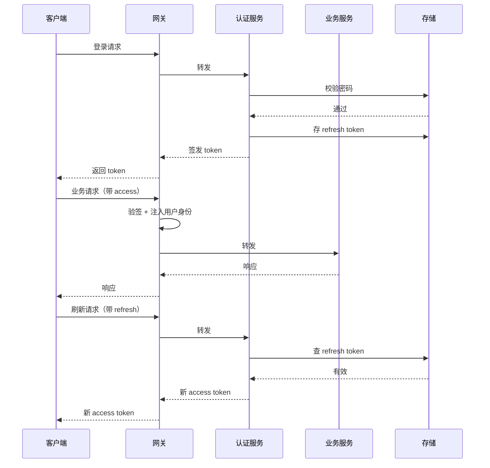

# 18 - 认证与登录

> 版本：v1.0  
> 适用项目：自主 Agent C/S 系统  
> 核心原则：治理集中，执行本地

---

## 目录

- [1. 背景与目标](#1-背景与目标)
- [2. 核心概念](#2-核心概念)
- [3. 认证方式选型](#3-认证方式选型)
- [4. 凭证机制](#4-凭证机制)
- [5. JWT 详解](#5-jwt-详解)
- [6. 双 Token 机制](#6-双-token-机制)
- [7. 登录完整流程](#7-登录完整流程)
- [8. 安全设计](#8-安全设计)
- [9. 设备与客户端管理](#9-设备与客户端管理)
- [10. 模块划分](#10-模块划分)
- [11. 接口设计](#11-接口设计)
- [12. 数据模型](#12-数据模型)
- [13. 与鉴权、权限的关系](#13-与鉴权权限的关系)
- [14. MVP 落地路线](#14-mvp-落地路线)

---

## 1. 背景与目标

### 1.1 背景

本系统采用 C/S 架构，核心原则是「治理集中，执行本地」：

- **服务端**：大脑 + 政策制定者，负责 Query Loop 编排、模型调用、上下文压缩、权限判定、会话持久化、审计与指标。
- **客户端**：手 + 执行现场，负责对话界面、文件读写、shell 执行、MCP 子进程、沙箱、域名审批。

在这个架构下，**认证（AuthN）是所有治理的前提**：

- 没有身份，权限无从判定。
- 没有身份，审计无从归属。
- 没有身份，成本无法计量。
- 没有身份，客户端无法管理。

### 1.2 目标

1. 确定客户端身份——证明「你是你说的那个用户 + 那台设备」。
2. 签发可信凭证——让后续请求可被网关快速校验。
3. 支持凭证刷新与失效——兼顾安全与体验。
4. 绑定设备维度——C/S 架构特有需求。
5. 为权限、审计、成本、客户端管理提供基础。

### 1.3 范围

**包含**：认证方式、凭证机制、登录/刷新/登出流程、安全设计、设备绑定、接口与数据模型、与鉴权权限的关系。


---

## 2. 核心概念

### 2.1 三个必须分清的词

| 词 | 英文 | 回答的问题 | 归属 |
|---|---|---|---|
| 认证 | Authentication (AuthN) | 你是谁？ | 本文档 |
| 授权 | Authorization (AuthZ) | 你能做什么？ | 13.1/13.2 |
| 审计 | Audit | 你做了什么？ | 7-可观测性 |

**本文档只负责 AuthN。**

### 2.2 三类认证因素

| 类型 | 说明 | 例子 |
|---|---|---|
| 你知道的 | Something you know | 密码、PIN |
| 你拥有的 | Something you have | 手机、硬件密钥、设备证书 |
| 你是什么 | Something you are | 指纹、人脸 |

三类是并列关系，**任一类单独成立即完成一次认证**，不需要凑齐三类。

多因素认证（MFA）= **跨类**叠加两种以上。同类型叠加不算多因素——密码 + PIN 仍是单因素。

生物特征不可撤销（泄露后无法像密码一样更改），故实践中只作设备本地解锁，不作唯一的远程认证凭据。

### 2.3 认证 vs 凭证

- **认证**：一次性动作，证明身份。
- **凭证**：认证成功后发放的「通行证」，后续请求携带。

登录 = 认证 + 发凭证。

---

## 3. 认证方式选型

### 3.1 可选方式

| 方式 | 说明 | 适用场景 |
|---|---|---|
| 账号密码 | 最基础 | 通用 |
| 邮箱/短信验证码 | 免密码 | 临时登录 |
| OAuth / OIDC | 第三方登录 | 「用 GitHub 登录」 |
| SSO | 单点登录 | 企业内部 |
| 设备证书 | 客户端证书 | C/S 长期客户端 |
| API Key | 长期密钥 | 服务间调用 |

### 3.2 本系统选型

| 阶段 | 认证方式 |
|---|---|
| MVP | 账号密码 + 设备指纹 |
| 进阶 | + OAuth / SSO |
| 高安全 | + 设备证书 / MFA |

---

## 4. 凭证机制

### 4.1 三种方案对比

| 方案 | 原理 | 优点 | 缺点 |
|---|---|---|---|
| Session + Cookie | 服务端存 session | 可随时失效 | 需服务端存储 |
| JWT | 服务端签名 | 无状态、跨服务 | 无法主动失效、Payload 明文 |
| Opaque Token | 随机串存库 | 可随时失效 | 每次查库 |

### 4.2 本系统选择：JWT + Refresh Token

- C/S 架构，客户端长期在线，需要无状态（JWT 优势）。
- JWT 无法主动失效，需要 refresh token 兜底。
- 两者结合，兼顾性能与安全。

### 4.3 凭证结构

```
登录成功
 ├─ access token（JWT，短期，15 分钟）
 └─ refresh token（不透明 token，长期，7 天，存库）
```

---

## 5. JWT 详解

### 5.1 什么是 JWT

**JWT = JSON Web Token**，一种自包含的、签名的、可验证的凭证。

> 服务端把「你是谁、什么时候过期」等信息签个名，交给客户端保存；之后客户端每次带着它，服务端验签就知道你是谁，不用查数据库。

关键词：自包含 + 无状态。

### 5.2 结构

```
xxxxx.yyyyy.zzzzz
  │      │      │
Header Payload Signature
```

**Header：**
```json
{
  "alg": "HS256",
  "typ": "JWT"
}
```

**Payload（claims）：**
```json
{
  "sub": "3f2a1c8e-...",
  "iss": "iwork",
  "iat": 1735689600,
  "exp": 1735693200
}
```

只放用户 ID，**不放 username / status**——放了就会和库里的值不一致（用户改名、被封号后 token 里仍是旧的）。需要这些信息时查库。

不放 `jti`：access token 不查库、也没有吊销清单，这个字段现在没有任何用途。

标准字段：

| 字段 | 含义 |
|---|---|
| sub | subject，用户 ID |
| iss | issuer，签发者 |
| aud | audience，接收方 |
| exp | 过期时间 |
| iat | 签发时间 |
| nbf | 生效时间 |
| jti | JWT 唯一 ID |

**Signature：**
```
HMACSHA256(
  base64UrlEncode(header) + "." + base64UrlEncode(payload),
  secret
)
```

签名不是加密，只是防篡改。

### 5.3 ⚠️ 核心认知：JWT 可解码

打开 [jwt.io](https://jwt.io)，粘贴 token，Header 和 Payload 立刻明文可见。

**绝对不要在 JWT 里放敏感信息。** Payload 只是 Base64 编码，不是加密。

### 5.4 签名算法选型

| 算法 | 类型 | 特点 | 适用 |
|---|---|---|---|
| HS256 | 对称 | 同一密钥签+验 | 单体/内部服务 |
| RS256 | 非对称 | 私钥签，公钥验 | 多服务/第三方 |

本系统：**HS256 起步**。若未来多服务验签，升级 RS256。

**绝不允许 `alg: none`。**

### 5.5 JWT 优缺点

**优点**：无状态、跨服务、性能好。

**缺点**：无法主动失效、体积大、Payload 明文、密钥泄露风险高。

---

## 6. 双 Token 机制

### 6.1 为什么需要

JWT 最大痛点：签发后无法主动失效。用户登出、封号、token 被盗，都无法立即吊销。

**解决方案：短过期 access token + 可吊销 refresh token。**

### 6.2 机制

```
登录
 ├─ access token（JWT，15 分钟）
 └─ refresh token（不透明 token，存库，7 天）

请求
 └─ 带 access token → 验签通过 → 放行

access token 过期
 └─ 用 refresh token 换新 access token
    ├─ refresh token 有效 → 发新 access token
    └─ refresh token 无效/过期 → 重新登录
```

### 6.3 优势

| 优势 | 说明 |
|---|---|
| 安全 | access token 短命，泄露危害小 |
| 可控 | refresh token 存库，可主动吊销 |
| 体验 | 自动刷新，用户无感 |
| 性能 | 大部分请求走 JWT，不查库 |

### 6.4 失效策略

| 场景 | 处理 |
|---|---|
| 用户登出 | 吊销该 refresh token |
| 改密码 | 吊销该用户所有 refresh token（含当前会话） |
| 封号 | 吊销所有 + 可选黑名单 |
| 设备丢失 | 吊销该设备 refresh token |
| access token 泄露 | 等 15 分钟自然过期 |

---

## 7. 登录完整流程

### 7.1 首次登录

```
1. 客户端启动
   └─ 检查本地是否有有效 token

2. 无 token → 显示登录界面
   └─ 用户输入账号密码
   └─ 客户端生成/读取设备指纹
   └─ 请求发给网关（不是认证服务）

3. 网关转发到认证服务
   └─ 校验账号密码
   └─ 绑定设备
   └─ 签发 access token + refresh token
   └─ 记录登录审计

4. 网关返回 token 给客户端
   └─ 客户端安全存储（系统密钥链）

5. 后续请求
   └─ 带 access token
   └─ 网关验签 + 检查过期
   └─ 通过 → 注入用户身份 → 转发业务服务
   └─ 不通过 → 401
```

### 7.2 Token 刷新

```
1. 客户端请求 → 401（access token 过期）
2. 客户端用 refresh token 请求刷新接口
3. 认证服务校验 refresh token（查库）
   ├─ 有效 → 签发新 access token（轮换 refresh token）
   └─ 无效 → 要求重新登录
4. 客户端更新本地 token，重试原请求
```

### 7.3 登出

```
1. 客户端请求登出
2. 网关转发到认证服务
3. 认证服务吊销 refresh token
4. 客户端清除本地 token
5. 记录登出审计
```

### 7.4 时序图



---

## 8. 安全设计

### 8.1 密码存储

| 做法 | 评价 |
|---|---|
| 明文 | ❌ 绝对禁止 |
| MD5 / SHA1 | ❌ 已被破解 |
| bcrypt / scrypt / Argon2 | ✅ 推荐 |

本系统：**bcrypt，cost 12**。直接用 `bcrypt` 库，不引已停止维护的 `passlib`。

密码长度限制 8–72 **字节**（`len(pw.encode())`，不是字符数）。72 是 bcrypt 的硬上限，超出部分被静默截断，会让两个不同的长密码变得等价；按字节算，24 个汉字即触顶。

### 8.2 传输安全

- 必须 HTTPS/TLS。
- 客户端到网关必须 TLS。
- 禁用旧版 TLS（1.0/1.1）。

### 8.3 防暴力破解

账号维度：连续失败 5 次锁 15 分钟（`failed_login_count` / `locked_until` 落在 `users` 表）。

- **先判锁定再验密码**：锁定期内直接返回 `ACCOUNT_LOCKED`，不跑 bcrypt（cost 12 没必要白烧）。代价是锁定态的响应比密码错更快、可被时序区分，但锁定是用户自己触发的，接受。
- **锁定期内即使密码正确也一律拒绝**——否则猜中密码即可绕过锁定。
- **登录成功时 `failed_login_count` 归零、`locked_until` 置 NULL**——否则断续的失败会攒够 5 次，把正常用户锁掉。
- 锁定期满后两个字段**一起清零**——否则下次一失败就立刻再锁，用户永远解不开。
- 失败计数用**原子递增**（`SET failed_login_count = failed_login_count + 1`），不要读-改-写，否则并发失败会丢计数。递增和置 `locked_until` 必须是**同一条 UPDATE**，形如 `locked_until = CASE WHEN failed_login_count + 1 >= 5 THEN now() + interval '15 min' ELSE locked_until END`——分两步写会并发漏锁。
- 用户不存在时也要照跑一次密码校验，且**必须用预先算好的固定假哈希**（模块级常量）——用临时随机值没有意义，两者的时间特征不一样。
- `password_hash IS NULL` 的账号一律返回 `INVALID_CREDENTIALS`，不区分对待。
- `status = disabled`（管理员封号）返回 `ACCOUNT_DISABLED`，与自动锁定（`ACCOUNT_LOCKED`）分开——前者只能人工解除，不能让用户等 15 分钟再来试。
- 锁定的时间比较**一律用 DB 的 `now()`**（`locked_until > now()` 写在 SQL 里），不要用应用进程时间——两边时钟不同步会出隐蔽的「刚锁上就能登」或「永远解不开」。
- 写 `login_logs` 是 **best-effort**：审计写失败（DB 抖动）不能让密码正确的登录返回 500。

已知取舍：账号维度可被用来恶意锁死他人账号。IP 维度对冲、指数退避、验证码均列为后续。

### 8.4 防重放

- refresh token 一次性使用（轮换），并在 `refresh_tokens` 记录 `revoked_at`。
- **30 秒宽限期**：`revoked_at` 在 30 秒内的旧 token 仍接受。客户端刷新请求的响应丢失后会带旧 token 重试，直接判定泄露会把用户误踢下线；超过窗口才判重放，吊销该用户全部 refresh token。
- **不采用**「时间戳 + nonce」：TLS 已保证传输完整性，且依赖客户端时钟会直接导致登录失败。

### 8.5 Token 安全

| 项 | 建议 |
|---|---|
| access token 过期 | 15 分钟 |
| access token 验签 | 不查库；封号后最长 15 分钟内旧 token 仍可用 |
| refresh token 过期 | 7 天，**滑动**——每次轮换新 token 的 `expires_at = now + 7 天` |
| refresh token 存储 | 存库，哈希后存 |
| refresh token 轮换 | 每次刷新换新 |
| token 存储位置 | 系统密钥链 / HttpOnly Cookie |
| refresh token 绝对上限 | 无——7 天内活跃一次即可持续续期（后续可加） |
| 客户端刷新分流 | `TOKEN_EXPIRED` → 静默刷新；`TOKEN_INVALID` / `REFRESH_TOKEN_INVALID` → 回登录页 |
| 禁止 | localStorage 存敏感 token |

### 8.6 防 CSRF

- 本系统推荐：token 存系统密钥链，不放 Cookie，天然防 CSRF。

### 8.7 防 XSS

- 前端输出转义。
- CSP 策略。
- 不把 token 放 localStorage。

### 8.8 会话固定攻击

- 登录成功后重新生成凭证。
- 不复用旧 session。

### 8.9 登出真正失效

- 服务端吊销 refresh token。
- 不能只删客户端本地。

### 8.10 密钥管理

- 密钥放密钥管理系统（见 20）。
- 不硬编码。
- 不同环境不同密钥。
- 定期轮换。
- HS256 密钥至少 256 位随机，启动时校验 ≥ 32 字节，不满足直接拒绝启动（校验放在 config 加载处，启动即失败）。
- 密钥环境变量名 `IWORK_JWT_SECRET`。
- JWT 只校验 `iss`（固定为 `iwork`）与 `exp`；单服务不校验 `aud`。
- 验签时 `algorithms=["HS256"]` 写死，拒绝 `alg: none`。
- 过期时长、失败阈值、锁定时长（15 分钟 / 7 天 / 5 次 / 15 分钟）放 config 并带默认值，env 可覆盖——写死在代码里，本地测试没法调短。

---

## 9. 设备与客户端管理

### 9.1 为什么 C/S 需要设备维度

- 客户端长期在线，需要识别「哪台设备」。
- 一台设备被盗，只吊销该设备。
- 支持「查看我的登录设备」。
- 配合沙箱配置、策略下发。

### 9.2 设备指纹

组成（示例）：
- 硬件 ID
- 操作系统 + 版本
- 客户端版本
- 机器名（哈希后）

存储：客户端首次生成，安全存储，登录时上报。

### 9.3 设备绑定

- 登录时绑定 `userId + deviceId`。
- JWT Payload 带 `deviceId`。
- 服务端维护「用户-设备」关系表。

### 9.4 设备管理功能

| 功能 | 说明 |
|---|---|
| 设备列表 | 查看用户所有登录设备 |
| 设备命名 | 用户可重命名 |
| 远程登出 | 吊销某设备 token |
| 新设备通知 | 新设备登录时通知用户 |
| 设备上限 | 限制同时在线设备数 |

### 9.5 客户端版本管理

- 网关按版本路由。
- 强制升级策略。
- 与 19-客户端与设备管理 联动。

---

## 10. 模块划分

### 10.1 服务端

```
认证服务（AuthN）
├── 账号管理（建号、密码哈希、账号状态）
├── 登录（密码校验、设备绑定、MFA）
├── Token 服务（签发、验签、刷新）
├── 会话管理（refresh token 存储、吊销、轮换）
├── 设备管理（注册、列表、远程登出）
└── 审计（登录日志、失败日志、异常检测）
```

### 10.2 网关

- 统一登录入口。
- 认证前置：验签 + 检查过期。
- 注入用户身份到请求上下文。
- 登录接口限流。

### 10.3 客户端

- 登录界面。
- 设备指纹生成。
- 安全存储 token：主进程 electron-store 存 `safeStorage.encryptString()` 后的密文，渲染进程不落盘。
- `safeStorage.isEncryptionAvailable()` 为 false 时（Linux 无 keyring）：dev 降级为明文存并告警，生产拒绝启动。
- 自动刷新 token。
- 登出时清理本地凭证。
- 请求头统一用 access token；原 `apiKey` 字段保留但不再用于请求。统一收敛到 `getAuthHeaders()`，不再各处内联。
- **只有 401 才清登录态**，网络不通时显示重试——否则服务端一挂，客户端就把人登出了。
- 401 按错误码分流（见 8.5）：`TOKEN_EXPIRED` 去刷新后重放原请求；`TOKEN_INVALID` / `REFRESH_TOKEN_INVALID` 才回登录页。
- **被动刷新**：只在收到 401 后刷，不做「提前 N 秒」的定时刷新——定时器会和单飞逻辑打架，且 401 这条路径本来就要处理。
- **刷新单飞**：并发多个 401 只发一次 refresh，其余等同一个 Promise。这不是性能优化——并发刷新会触发服务端重放检测，把用户踢下线（见 8.4）。
- 刷新失败时提示「登录已过期，请重新登录」，不要静默跳回登录页。
- 启动引导：本地有 access token 但已过期 → 先静默刷新，失败才显示登录页。渲染进程要等一个「认证就绪」信号再发业务请求，否则启动瞬间会甩出一堆 401。
- 删掉 `configStore.ts` 里 `|| '00000000-0000-0000-0000-000000000001'` 这类硬编码用户 ID 回退，身份一律来自 `/auth/me`。
- `api.ts` 的 `reportMcpTools` 不再在 body 里传 `user_id`，服务端从 token 取。
- 单账号。


---

## 11. 接口设计

### 11.1 接口清单

| 接口 | 方法 | 路径 | 说明 |
|---|---|---|---|
| 登录 | POST | /auth/login | 账号密码登录 |
| 刷新 | POST | /auth/refresh | 换新 access token；用 refresh token 本身认证，无需 access |
| 登出 | POST | /auth/logout | 吊销 refresh token；请求体带 `refresh_token`，不要求 access token。**幂等**——token 已失效也返回 200 |
| 登出所有设备 | POST | /auth/logout-all | 用 access token 认证，吊销该用户全部 refresh token。**当前客户端也在此列**，客户端要主动清本地回登录页，不能等下次 401 |
| 当前用户 | GET | /auth/me | 返回 `{id, username, display_name, status}`；**查库**，不用 token 里的旧快照 |
| 设备列表 | GET | /auth/devices | 查看登录设备（第 4 步） |
| 远程登出设备 | DELETE | /auth/devices/{id} | 吊销某设备（第 4 步） |
| 修改密码 | POST | /auth/change-password | 只改密码，不改 username。需 `old_password`（错则返回 `INVALID_CREDENTIALS`）；改密后吊销全部（含当前会话），**响应直接返回新的一对 token**，否则客户端改完即被踢 |

> 字段命名一律 snake_case，与现有业务接口（`session_id`、`updated_at`）保持一致，不要另起 camelCase。
>
> **没有自助注册**：账号由管理员在后台创建并交付密码（`POST /system/user`，doc 19-4.2），登录页只有登录。
>
> 建号的查重不能只靠「先 SELECT 再 INSERT」——并发下两个请求会同时通过。靠 `username` 唯一索引兜底，捕获 `IntegrityError` 转成 `USERNAME_TAKEN`。

### 11.2 登录接口

**请求：**
```json
POST /auth/login
{
  "username": "ai-4Work",
  "password": "******"
}
```

**响应：**
```json
{
  "access_token": "eyJ...",
  "refresh_token": "rt_xxxxx",
  "expires_in": 900,
  "user": {
    "id": "3f2a1c8e-...",
    "username": "ai-4work",
    "display_name": "ai-4Work",
    "status": "active"
  }
}
```

**错误：**
```json
{
  "error": "INVALID_CREDENTIALS",
  "message": "账号或密码错误"
}
```

账号不存在与密码错误返回**同一个错误**，避免登录接口变成账号枚举器；用户不存在时也要照跑一次密码校验，否则响应快慢能反推账号是否存在。锁定期内返回 `ACCOUNT_LOCKED`。

### 11.3 刷新接口

**请求：**
```json
POST /auth/refresh
{ "refresh_token": "rt_xxxxx" }
```

**响应：**
```json
{
  "access_token": "eyJ...",
  "refresh_token": "rt_yyyyy",
  "expires_in": 900
}
```

注意：refresh token 轮换（一次一换）。旧的 30 秒内仍可用（见 8.4），超过才判重放。明文形式为 `rt_` + 32 字节随机串，前缀便于日志识别与泄露扫描。

token 过期、被登出吊销、重放三种情况**统一返回 `REFRESH_TOKEN_INVALID`**，不细分。客户端处理动作一样（回登录页），细分只会给攻击者多一个判断信号。

### 11.4 错误码

| 码 | HTTP | 含义 |
|---|---|---|
| INVALID_CREDENTIALS | 401 | 账号或密码错误（含账号不存在、`password_hash` 为空） |
| USERNAME_TAKEN | 409 | 用户名已被占用 |
| ACCOUNT_LOCKED | 403 | 账号自动锁定 |
| ACCOUNT_DISABLED | 403 | 账号被管理员封禁 |
| TOKEN_EXPIRED | 401 | access token 过期 → 客户端去刷新 |
| TOKEN_INVALID | 401 | access token 无效 → 客户端回登录页 |
| REFRESH_TOKEN_INVALID | 401 | refresh token 无效或已重放 |
| DEVICE_LIMIT_EXCEEDED | 403 | 设备数超限 |
| MFA_REQUIRED | 401 | 需要 MFA |

响应体统一 `{"error": "<码>", "message": "<人话>"}`。auth 模块用大写码；现有业务接口的小写字串（`not_found` 等）本次不动，不引入全局错误中间件。

---

## 12. 数据模型

### 12.1 用户表 `users`

| 字段 | 类型 | 说明 |
|---|---|---|
| id | string | 用户 ID |
| username | string | 用户名（唯一）。**入库前和登录查询前都 `.lower()`**——PG 唯一索引大小写敏感，不规范化 `Ai4work` 与 `ai4work` 会变成两个账号，且大写输入永远登不进来。长度 3–32，限 `[a-z0-9_-]` |
| display_name | string | 显示名称 |
| password_hash | string | bcrypt 哈希；NULL 表示不可密码登录 |
| status | enum | active / disabled（仅管理员态） |
| failed_login_count | int | 连续登录失败次数（NOT NULL DEFAULT 0） |
| locked_until | timestamp | 自动锁定截止时间；NULL 表示未锁定 |
| created_at | timestamp | 创建时间 |
| updated_at | timestamp | 更新时间 |

> 自动锁定与管理员封号（`status`）分开存：前者到期自解，后者只能人工解除。
>
> 新增的 `status` / `failed_login_count` 必须带 `server_default`（`'active'` / `0`），否则已成存量的 `users` 行会因 NOT NULL 迁移失败。`password_hash` 可空——NULL 即「不可密码登录」。

### 12.2 设备表 `devices`

| 字段 | 类型 | 说明 |
|---|---|---|
| id | string | 设备 ID |
| user_id | string | 所属用户 |
| device_fingerprint | string | 设备指纹 |
| device_name | string | 设备名 |
| last_seen_at | timestamp | 最后在线 |
| status | enum | active / revoked |
| created_at | timestamp | 首次登录 |

### 12.3 Refresh Token 表 `refresh_tokens`

| 字段 | 类型 | 说明 |
|---|---|---|
| id | string | token ID |
| user_id | string | 所属用户 |
| token_hash | string | sha256 哈希后存储（唯一索引） |
| expires_at | timestamp | 过期时间 |
| revoked_at | timestamp | 吊销时间；NULL 即未吊销（供 8.4 宽限期判断） |
| created_at | timestamp | 签发时间 |
| rotated_to | string | 轮换后的新 token id，只作轮换链审计 |

> `token_hash` 用 sha256 而非 bcrypt：refresh token 是 32 字节随机串、熵已足够，慢哈希只会白白拖慢每次刷新；bcrypt 是为低熵密码防爆破设计的。
>
> 不设 `revoked` 布尔——`revoked_at IS NULL` 就是"未吊销"，两者并存会出现互相矛盾的状态。
>
> 索引：`token_hash` 唯一索引（续期时按它查）；`user_id` 索引（logout-all / 改密要按用户批量吊销）。

### 12.4 登录日志表 `login_logs`

| 字段 | 类型 | 说明 |
|---|---|---|
| id | string | 日志 ID |
| user_id | string | 用户；密码错或账号不存在时为 NULL |
| attempt_username | string | 本次尝试的账号（用于排查爆破） |
| ip | string | 来源 IP |
| user_agent | string | 客户端信息 |
| result | enum | success / fail |
| reason | string | 失败原因 |
| created_at | timestamp | 时间 |

> 本表只做审计，锁定判断不依赖它——锁定状态由 `users.failed_login_count` / `locked_until` 承载。
>
> `created_at` 建索引（按时间排查）；`ip` / `user_agent` 由服务端从请求取，本地开发时 IP 恒为 127.0.0.1。无清理策略，列为后续。

---

## 13. 与鉴权、权限的关系

### 13.1 三者分工

| 模块 | 职责 | 时机 |
|---|---|---|
| 登录（AuthN） | 确定你是谁 | 一次性 |
| 鉴权依赖 | 认证前置：验签 + 注入身份，返回 `UUID` | 每次请求 |
| 权限（AuthZ） | 确定你能做什么 | 每次请求（细粒度） |

> 本文档其余章节出现的「网关」，指的是同为认证前置角色、但本次不实现的统一入口。MVP 阶段这一职责由服务端的鉴权依赖承担。

### 13.2 请求链路

```
客户端
  │ 带 access token
  ▼
鉴权依赖（get_current_user）
  ├─ 验签 + 检查过期（不查库）
  ├─ 注入用户身份
  ▼
权限引擎（13.2）
  ├─ 粗判：有没有资格
  ├─ 细判：能不能做这个操作
  ▼
业务服务
```

### 13.3 关键区分

- 鉴权依赖：只验证 token 是否有效，不判断权限。
- 权限引擎：判断「这个用户能不能做这个操作」。
- 登录：只负责发凭证，不管后续。


---

## 14. MVP 落地路线

### 实现范围：做与不做

**做：**

| 出处 | 内容 |
|---|---|
| 12.1 | users 加 `password_hash` / `status` / `failed_login_count` / `locked_until` |
| 12.3 | `refresh_tokens` 表（不含 `device_id`） |
| 12.4 | `login_logs` 表（不含 `device_id`） |
| 11.1 | 登录、刷新、登出、登出所有设备、当前用户、修改密码 |
| 8.1 | bcrypt（cost 12）存密码 |
| 8.3 | 失败 5 次锁 15 分钟（账号维度） |
| 8.4 | refresh token 一次性使用（轮换 + 重放检测） |
| 8.5 | access 15 分钟 / refresh 7 天滑动 / 存库哈希 / 每次刷新轮换 |
| 8.9 | 登出真吊销（服务端，不能只删本地） |
| 10.3 | 登录界面、系统密钥链存 token、自动刷新、登出清理 |
| 13.1 | 现有业务接口改用 `get_current_user` 鉴权（`routes.py` / `skill_routes.py` / `mcp_routes.py` 共 28 处 `get_default_user_id` 全部替换；替换完 `get_default_user_id`、`app.state.default_user_id`、`seed_default_user` 与那一行 `default-user` 一并删除，迁移见 `022_drop_default_user`） |


**不做：**

| 出处 | 内容 | 原因 |
|---|---|---|
| 10.2 / 14-第 2 步 | 网关 | 本次客户端直连服务端，网关留待接入业务服务时再做 |
| 9 / 12.2 / 11.1 | 设备指纹、设备表、设备管理、远程登出 | 列为第 4 步 |
| 14-第 5 步 | OAuth / SSO、MFA、设备证书、异常登录检测 | 进阶 |
| 8.2 | HTTPS / TLS | 本地开发阶段未配 |
| 8.4 | 时间戳 + nonce 防重放 | TLS 已保证传输完整性；依赖客户端时钟会直接导致登录失败 |
| 8.6 | 防 CSRF | 不放 Cookie，天然不适用 |
| 8.7 | 防 XSS | 桌面客户端非 Web，无此攻击面 |
| 8.8 | 会话固定攻击 | 无 session ID 概念，不适用 |
| 8.10 | 密钥管理系统 | 密钥先放本地 `.env` |

